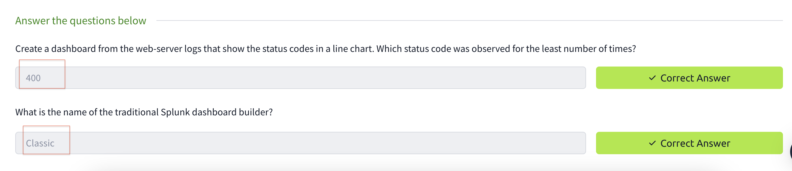
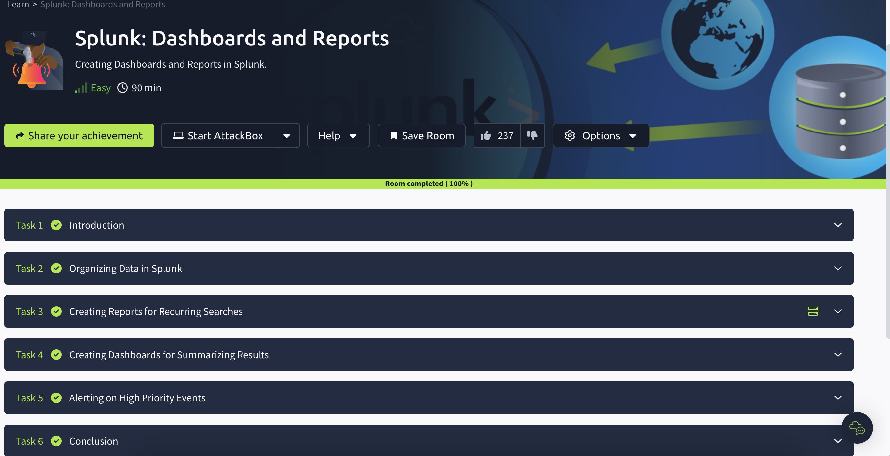

# Splunk-Dashboards-and-Reports

I completed the Splunk: Dashboards and Reports course on TryHackMe, where I learned how to create reports for recurring searches, build dashboards for summarizing results, and set up alerts for high-priority events.

## Task2 Correct Answer

## Task3-1

## Task3-2

## Task3 Correct Answer

## Task4-1

## Task4-2

## Task4 Correct Answer

## Task5 Correct Answer

## AllTaskCompleted

